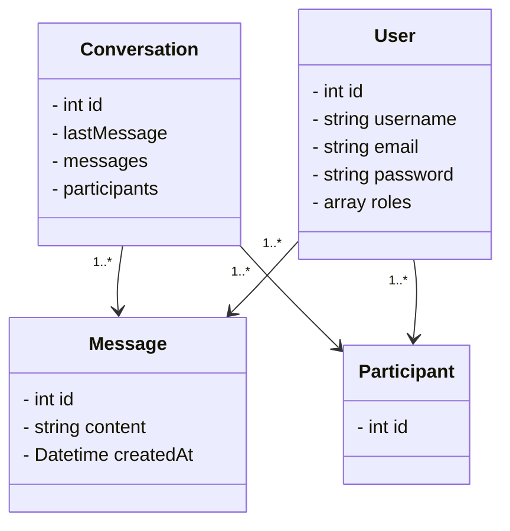

# REAL TIME CHAT MESSENGER

---

This chat application is based on server sent event. This implements Mercure protocol to make this possible.\

## Introduction

### Mercure documentation
Check documentation on [Mercure documentation](https://mercure.rocks/).

## 1 Entities relationship

